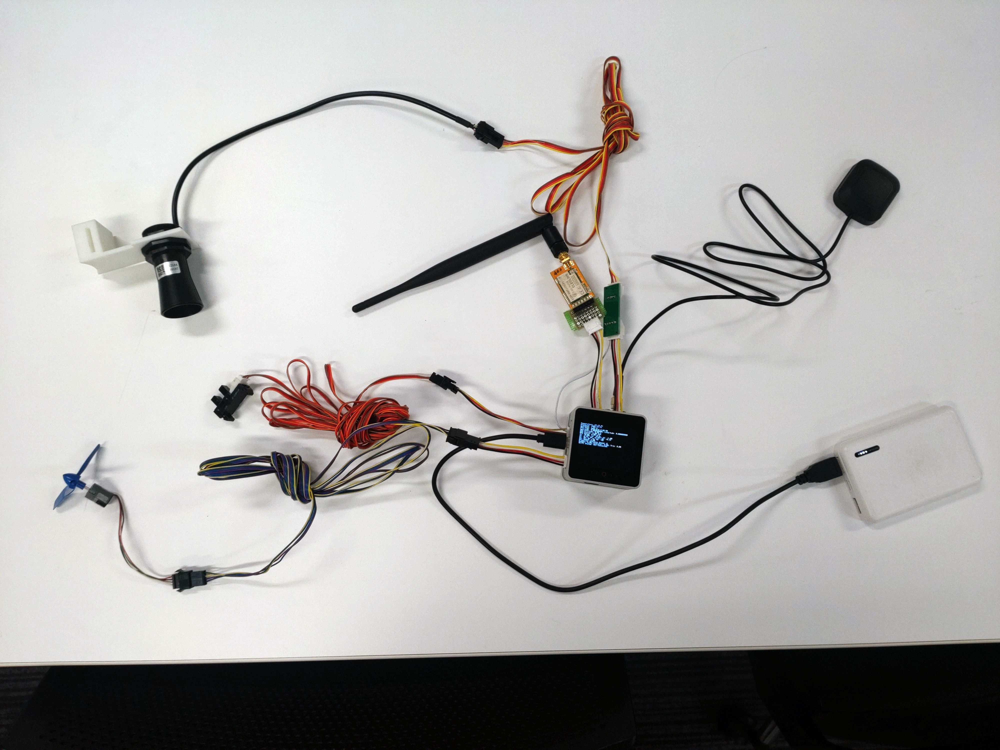

# HPA Measurement System

人力飛行機の計測システムのリポジトリ

- [HPA_Measurement](/HPA_Measurement) ... 機体計測システム
- [HPA_LoRa](/HPA_LoRa) ... LoRa受信システム

## Notice

`secrets.h`にWi-Fiのパラメータ、AWSの秘密鍵等を設定する。以下のコマンドでGitの追跡対象から除外する。

```
git update-index --assume-unchanged HPA_Measurement/src/secrets.h
```

## Diagram


## Overview


